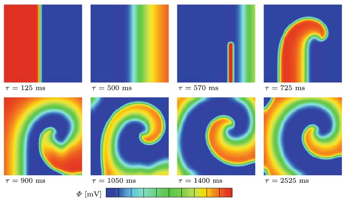

# Cardiac Electrophysiology Simulation

This repository contains 6 different implementations of Aliev-Panfilov heart electrophysiology simulator.

## Background

Cardiac electrophysiology simulators can be used for clinical diagnostic and therapeutic purposes. They solve two equations repetitively: a system of Ordinary Differential Equations (ODEs) together with Partial Differential Equations (PDEs). This simulator models the propagation of electrical signals in the heart, and it incorporates a cell model describing the kinetics of a the membrane of a single cell. The PDE couples multiple cells into a system. This simulator uses a model known as the Aliev-Panfilov model, that maintains 2 state variables, and solves one PDE. This simple model can account for complex behavior such as how spiral waves break up and form elaborate patterns. Spiral waves can lead to life threatening situations such as ventricular fibrillation (a medical condition when the heart.muscle twitches randomly rather than contracting in a coordinated fashion).



This simulator models electrical signals in an idealized system in which voltages vary at discrete points in time, called timesteps on discrete positions of a mesh of points. At each time step, the simulator updates the voltage according to nearest neighboring positions in space and time. This is done first in space, and next in time. Nearest neighbors in space are defined on the north, south, east and west.

## Project Structure

```bash
cardiac-simulation/        
                    src/                            # Contains source code
                        cpu_implementation.cu
                        gpu_implementation1.cu      # PDE and ODE are in different kernels
                        gpu_implementation2.cu      # PDE and ODE are in the same kernel
                        gpu_implementation3.cu      # Uses registers to decrease global memory access
                        gpu_implementation4.cu      # Shared memory implementation
                        gpu_implementation5.cu      # Persistent kernel implementation
                        kernels.cu                  # Contains all kernels
                        utils.cu                    # Utility functions
                    include/                        
                        kernels.h                   # Contains kernel declarations
                        utils.h                     # Contains utility function declarations
                    results/                        # I dump the final content of arrays here to compare with the original implementation
                    scripts/                        # Contains scripts for convenience  
```

## Build

```sh
$ git clone git@github.com:mabdullahsoyturk/cardiac-simulation.git
$ cd cardiac-simulation
$ make
```

## Run

n is the domain size. You can think of it like one of the dimensions of a matrix. If you specify n = 1024, you run the stencil operation on 1026x1026 matrix because you have halos on all sides.

```sh
$ ./gpu_implementation1 -n 1024 -t 500
$ ./gpu_implementation2 -n 1024 -t 500
$ ./gpu_implementation3 -n 1024 -t 500
$ ./gpu_implementation4 -n 1024 -t 500
$ ./cpu_implementation -n 1024 -t 500
```

## Execution Time and GFlop/s

The experiments are done on a V100 GPU and a Intel(R) Xeon(R) Gold 6148 CPU @ 2.40GHz.


| Size | CPU | GPU1 | GPU2 | GPU3 | GPU4 | GPU5 | 
| ------ | ------ | ------ | ------ | ------ | ------ | ------ |
| 32x32, t=500 |     0.275381s |    0.514294s | 0.444979s |  0.453864s | 0.45327s |  0.0163369s  |
| 64x64, t=500 |     0.90632s |     0.590296s | 0.547977s |  0.535228s | 0.525459s|  0.0197961s |
| 128x128, t=500 |   3.14636s |     1.08743s |  0.99337s |   0.994193s | 0.996683s | 0.0253801s |
| 256x256, t=500 |   19.705s |      4.41052s |  4.33762s |   4.34162s |  4.2913s |   0.060096s |
| 512x512, t=500 |   207.396s |     39.6157s |  39.1749s |   39.2181s |  39.2334s |  0 |
| 1024x1024, t=500 | 2955.68s |     527.377s |  524.705s |   524.582s |  524.065s |  0 |

Persistent kernel implementation does not scale more than 256x256 because cooperative groups allows us to launch at most 1 block per SM (Assuming each thread block contains max number of threads, in my experiments 1024).

| Implementation | GFlop/s (V100) | GFlop/s (A100) |
| ------ | ------ | ------ |
| GPU Implementation1 | 290.917 | 398.067 |
| GPU Implementation2 | 406.88 | 469.252 |
| GPU Implementation3 | 407.567 | 472.202 |
| GPU Implementation4 | 436.825 | 596.678 |

## Bandwidth Analysis

Maximum achievable bandwidth on the system (based on bandwidthTest of [CUDA Samples](https://github.com/NVIDIA/cuda-samples/tree/master/Samples/1_Utilities/bandwidthTest)): 

| Host-to-Device | Device-to-Host | Device-to-Device |
| ------ | ------ | ------ |
| 12.4 GB/s | 13.1 GB/s | 705.2 GB/s |

Bandwidth of each version for n = 1024, t = 500:

| Implementation | Bandwidth |
| ------ | ------ |
| GPU Implementation1 | 8.13062 GB/s |
| GPU Implementation2 | 8.18945 GB/s |
| GPU Implementation3 | 8.19028 GB/s |
| GPU Implementation4 | 8.19527 GB/s |

## Reference

CPU implementation is based on the code orginally provided by Xing Cai from Simula Research Laboratory and reimplementation by Scott B. Baden, UCSD and modification by Didem Unat, Koc University.

Refer to [Detailed Numerical Analyses of the Aliev-Panfilov Model on GPGPU](https://www.simula.no/publications/detailed-numerical-analyses-aliev-panfilov-model-gpgpu) by Xing Cai, Didem Unat and Scott Baden.

First spiral wave figure is from [Atrial and ventricular fibrillation: Computational simulation of spiral waves in cardiac tissue](https://www.researchgate.net/publication/225550049_Atrial_and_ventricular_fibrillation_Computational_simulation_of_spiral_waves_in_cardiac_tissue) by Serdar Goktepe, Jonathan Wong and Ellen Kuhl.
